# BackPack Buddies

A social networking app for travelers and backpackers to connect, share experiences, find travel buddies, and discover job opportunities on the go.

## 📱 Features

- **User Authentication** - Secure sign up and sign in
- **Interactive Maps** - Discover nearby travelers and locations
- **Travel Buddies** - Connect with fellow backpackers
- **Real-time Chat** - Message with photos, videos, voice notes, and location sharing
- **Job Listings** - Find travel-related job opportunities
- **Push Notifications** - Stay updated with connection requests and messages
- **Profile Management** - Customize your travel profile

## 🖼️ Screenshots

### Onboarding & Authentication

<div align="center">
  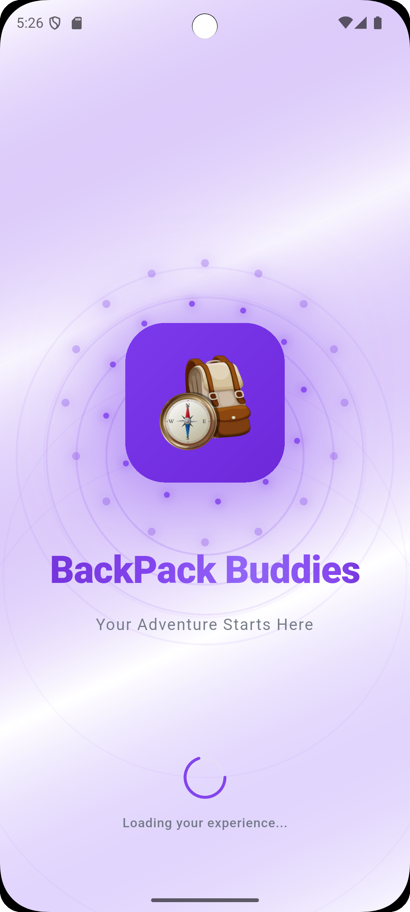
  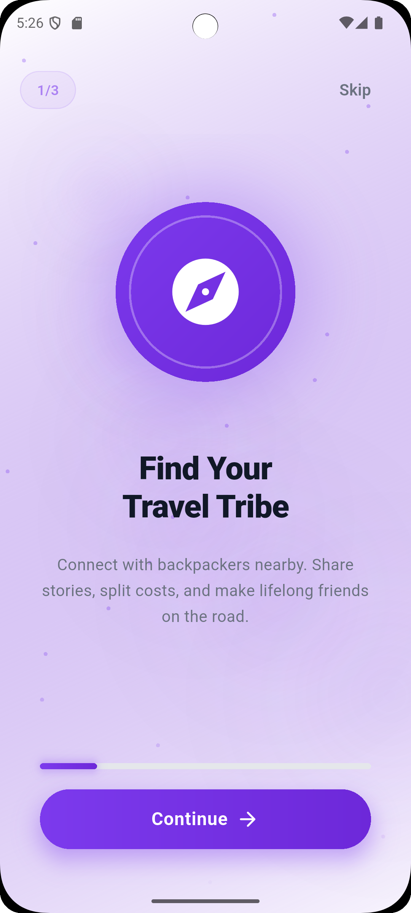
  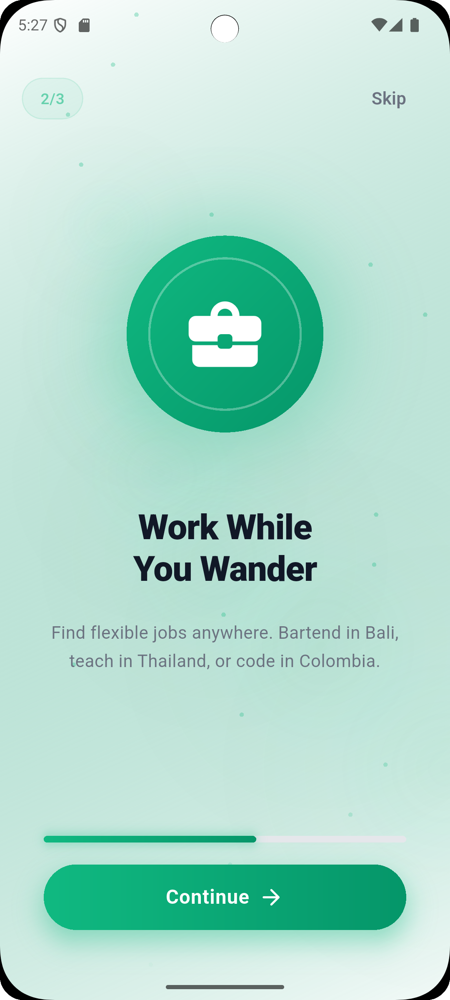
  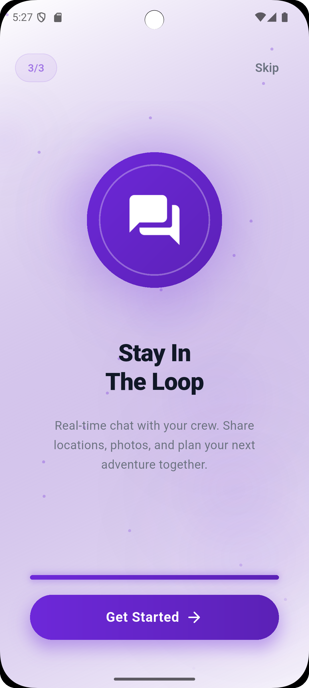
</div>

<div align="center">
  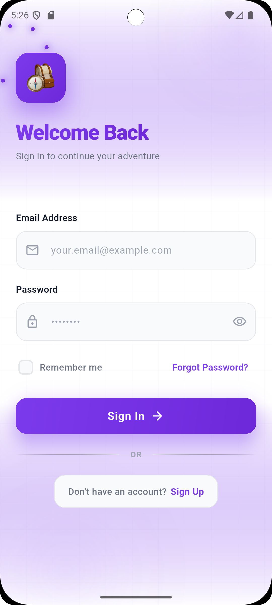
  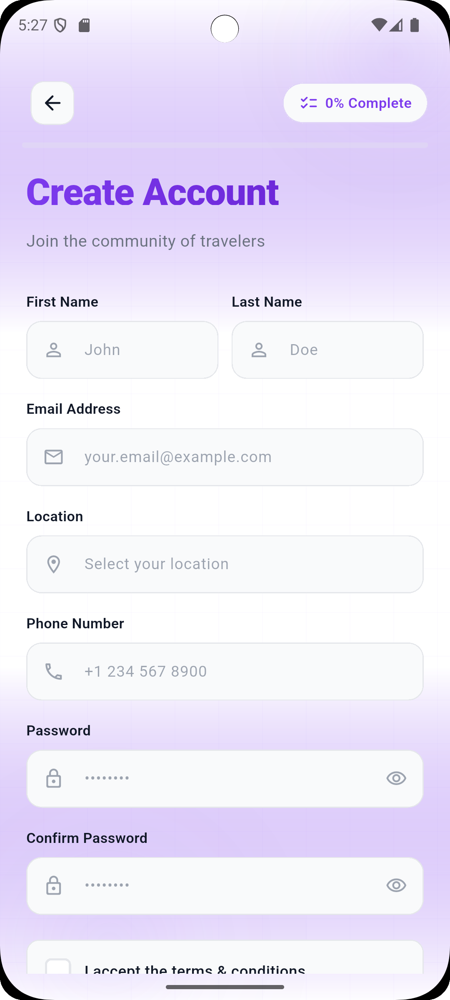
  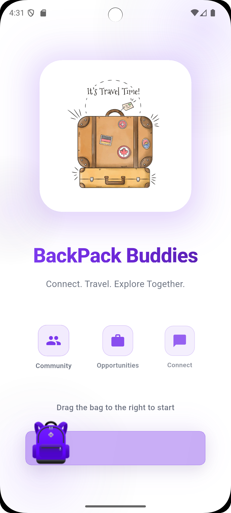
</div>

### Main Features

<div align="center">
  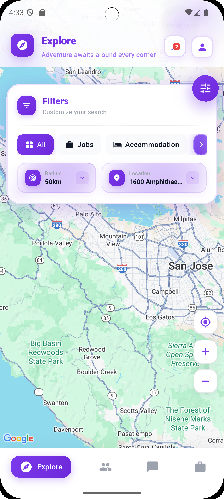
  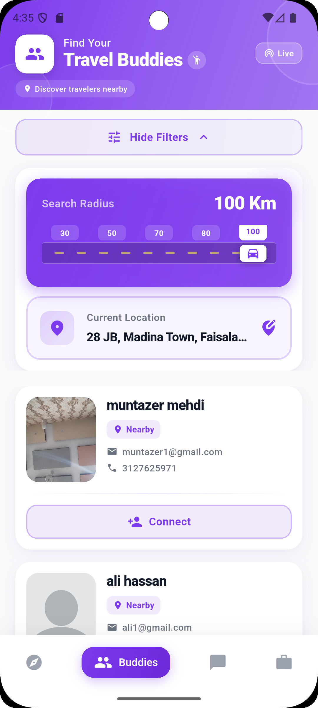
  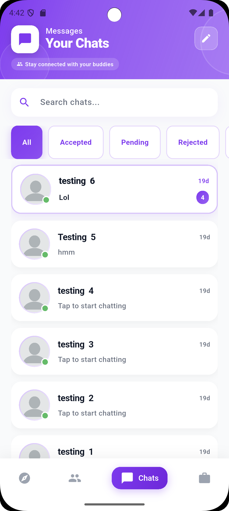
  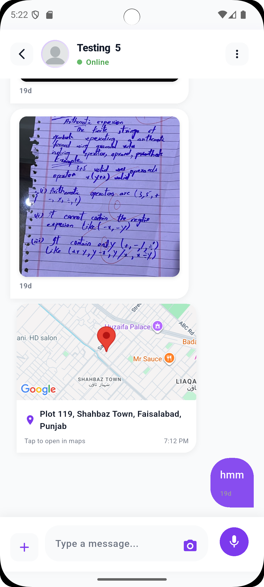
</div>

### Jobs & Profile

<div align="center">
  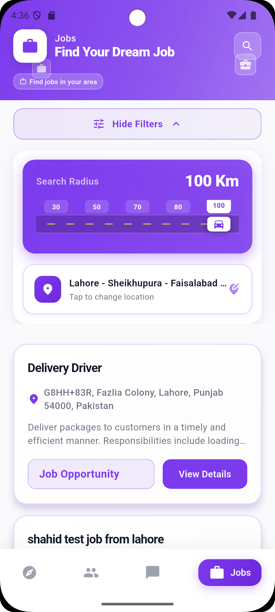
  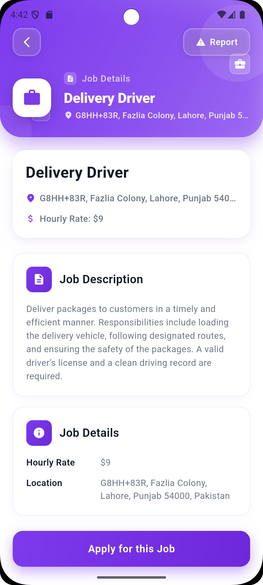
  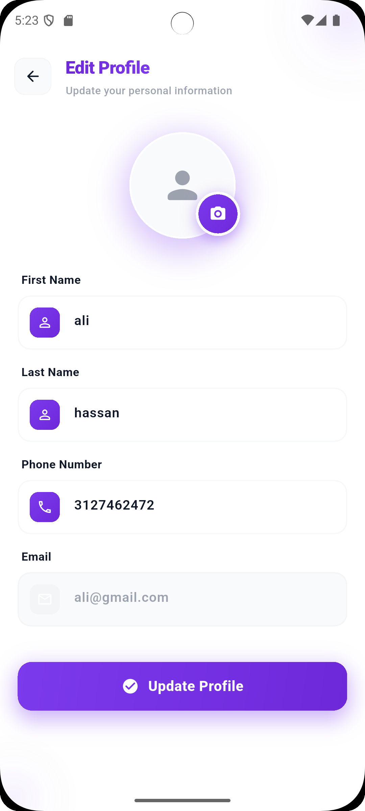
  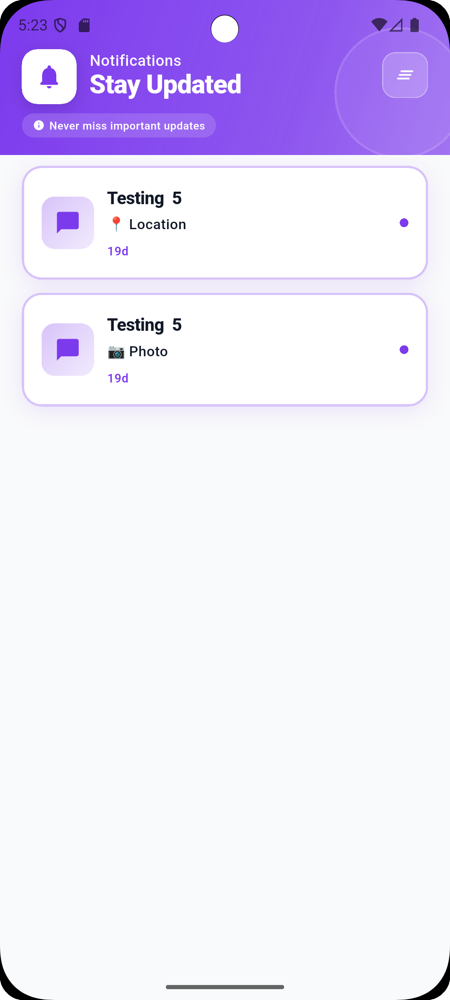
</div>

### Additional Screens

<div align="center">
  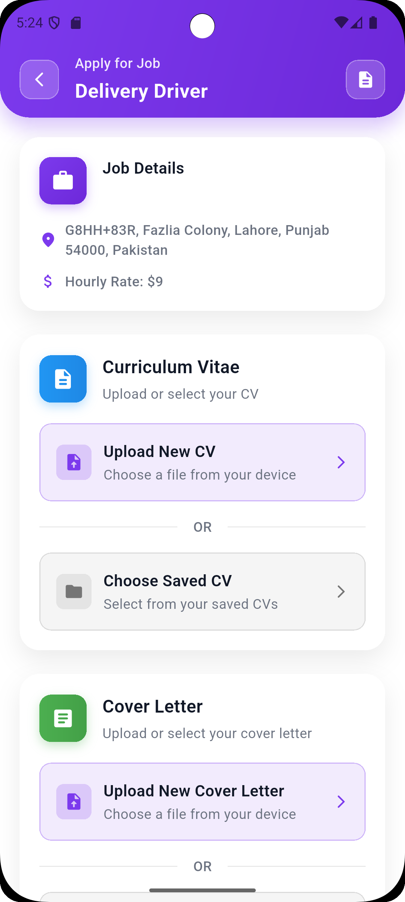
  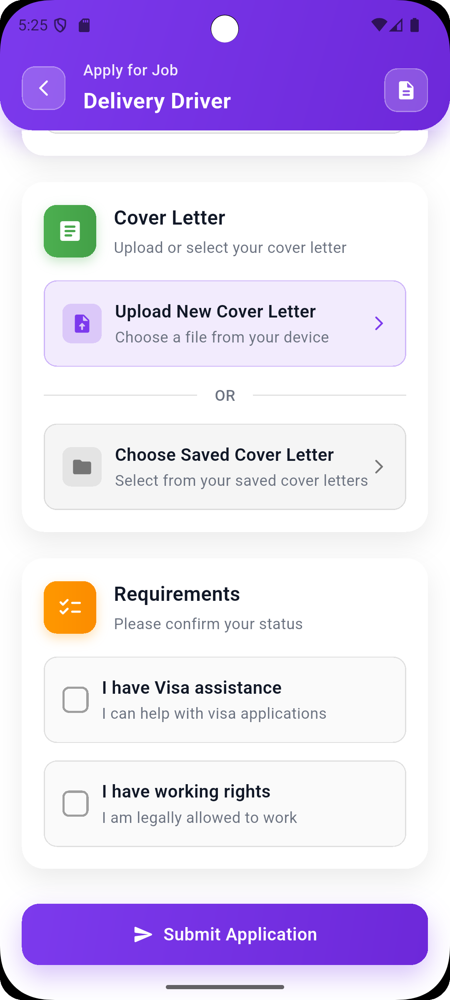
  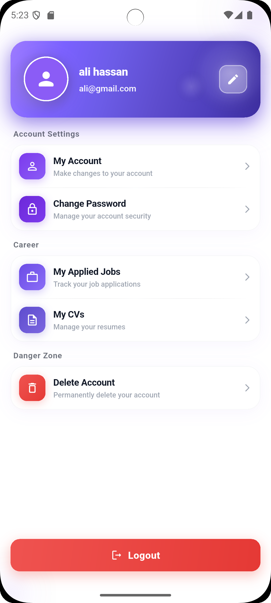
</div>

## 🛠️ Tech Stack

- **Framework**: Flutter 3.9.2+
- **State Management**: GetX
- **Backend**: Firebase (Authentication, Firestore, Cloud Messaging, Storage)
- **Maps**: Google Maps Flutter
- **Local Storage**: SharedPreferences, SQLite (Sqflite)
- **Media**: Image Picker, Video Player, Audio Player, Image Cropper

## 📋 Prerequisites

- Flutter SDK (3.9.2 or higher)
- Dart SDK
- Android Studio / Xcode (for mobile development)
- Firebase project setup
- Google Maps API key

## 🚀 Getting Started

### 1. Clone the repository

```bash
git clone https://github.com/M-Muntazer-Mehdi/BackPack.git
cd BackPack
```

### 2. Install dependencies

```bash
flutter pub get
```

### 3. Firebase Setup

1. Create a Firebase project at [Firebase Console](https://console.firebase.google.com/)
2. Add your Android/iOS apps to the project
3. Download `google-services.json` (Android) and `GoogleService-Info.plist` (iOS)
4. Place them in:
   - `android/app/google-services.json`
   - `ios/Runner/GoogleService-Info.plist`

### 4. Configure API Keys

Update `lib/globals/constants.dart` with your API keys:

```dart
static const stripeKey = "YOUR_STRIPE_SECRET_KEY_HERE";
static const stripePublishKey = "YOUR_STRIPE_PUBLISHABLE_KEY_HERE";
static String STR_GOOGLE_API_KEY = 'YOUR_GOOGLE_MAPS_API_KEY';
```

### 5. Run the app

```bash
# For Android
flutter run

# For iOS
flutter run -d ios
```

## 📦 Build

### Android

```bash
# Release APK
flutter build apk --release

# Release App Bundle (for Play Store)
flutter build appbundle --release
```

### iOS

```bash
flutter build ios --release
```

## 📝 Important Notes

- Sensitive files (keystore, Firebase configs, credentials) are gitignored
- Replace placeholder API keys before building for production
- Ensure proper Firebase security rules are configured
- Google Maps API key must have proper restrictions enabled

## 📄 License

This project is private and proprietary.

## 👥 Contributing

This is a private repository. For access or contributions, please contact the repository owner.

---

**Made with ❤️ for travelers and backpackers**
