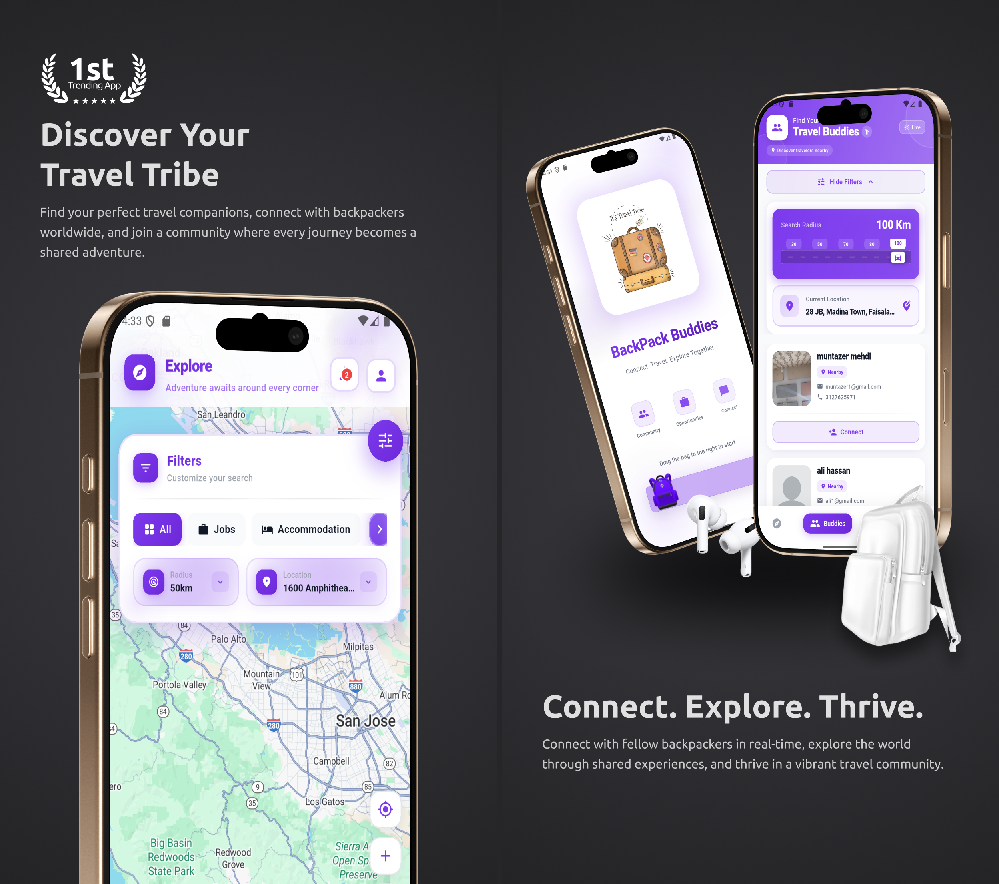

<div align="center">



</div>

# BackPack Buddies

<div align="center">


**An enterprise-grade mobile application built with Flutter, featuring real-time geolocation services, advanced messaging capabilities, and cloud-based infrastructure. This production-ready platform demonstrates expertise in cross-platform development, Firebase integration, state management, and modern mobile architecture patterns.**

[Features](#-key-features) • [Screenshots](#-feature-showcase) • [Installation](#-installation) • [Documentation](#-documentation)

</div>

---

## 📖 Overview

BackPack Buddies is a production-ready, enterprise-level mobile application showcasing advanced Flutter development practices and modern software architecture. This full-stack application demonstrates proficiency in cross-platform mobile development, real-time data synchronization, cloud infrastructure management, and complex state management patterns.

**Technical Highlights:**
- **Scalable Architecture**: Implemented using GetX for reactive state management, dependency injection, and navigation, following clean architecture principles
- **Real-Time Infrastructure**: Leverages Firebase Cloud Firestore for real-time data synchronization, Firebase Cloud Messaging for push notifications, and Firebase Cloud Functions for serverless backend operations
- **Advanced Location Services**: Integrated Google Maps SDK with geolocation tracking, geofencing, and proximity-based user discovery algorithms
- **Media Handling**: Comprehensive media management system supporting image processing, video playback, audio recording, and file uploads with Firebase Storage
- **Production Deployment**: Configured for both Android (Google Play Store) and iOS (App Store) with proper signing, versioning, and release management
- **Security & Best Practices**: Implements secure authentication flows, API key management, and follows OWASP mobile security guidelines

This project serves as a comprehensive demonstration of end-to-end mobile application development, from initial design and architecture to deployment and maintenance, suitable for portfolio review by technical recruiters and hiring managers.

## ✨ Key Features

### 🔐 Application Launch & Authentication Flow

The application implements a sophisticated launch sequence and authentication system that provides a seamless user experience from first launch to authenticated state. The flow is designed with attention to user experience, performance optimization, and secure credential management.

---

#### 🎬 Splash Screen & Launch Sequence

The application begins with an animated splash screen displaying app branding while initializing critical services (Firebase, FCM, local storage) in the background. The launch screen then handles intelligent routing based on user authentication state and first-time user status.

**Key Capabilities:**
- Animated splash screen with app branding
- Asynchronous service initialization
- Intelligent routing based on authentication state
- Session state detection and automatic navigation

<table>
<tr>
<td style="padding-right: 2em;"></td>
<td></td>
</tr>
</table>

---

#### 📚 Onboarding Experience

A multi-screen onboarding flow introduces first-time users to the application's core features through animated transitions and clear messaging. The flow includes progress indicators and can be skipped by returning users.

**Key Capabilities:**
- Interactive multi-screen onboarding with animations
- Feature highlights and value proposition
- Progress indicators and skip functionality
- First-time user detection and state persistence

<table>
<tr>
<td style="padding-right: 1em;"></td>
<td style="padding-right: 1em;"></td>
<td></td>
</tr>
</table>

---

#### 🔒 User Authentication System

The authentication system provides secure, reliable user account management through Firebase Authentication. The implementation includes comprehensive login and registration flows with email verification, password management, and session persistence. The system handles various authentication states, error scenarios, and provides a smooth user experience while maintaining security best practices.

**Technical Implementation:**
- **Firebase Authentication**: Email/password authentication with secure credential management
- **Form Validation**: Real-time input validation with user-friendly error messages
- **Session Management**: Automatic session persistence and token refresh
- **Error Handling**: Comprehensive error handling for network issues, invalid credentials, and account states
- **Security Features**: Password strength requirements, secure credential storage, and API key protection
- **State Management**: GetX controllers manage authentication state and form validation

**Key Capabilities:**
- Secure email-based registration with validation
- Login with email and password authentication
- Session persistence and automatic login for returning users
- Password reset and account recovery flows
- Real-time form validation with helpful error messages
- Firebase Authentication integration with error handling
- Secure credential storage and token management
- Account state management (logged in, logged out, session expired)

**Authentication Screens:**

<table>
<tr>
<td style="padding-right: 2em;"></td>
<td></td>
</tr>
</table>

---

### 🗺️ Interactive Map & Location Services

The core feature of BackPack Buddies is its advanced map interface powered by Google Maps, which enables users to visualize their location and discover nearby travelers in real-time. The map provides geolocation-based user discovery, distance calculations, and interactive markers for enhanced social interaction.

**Key Capabilities:**
- Real-time location tracking and updates
- Google Maps integration with custom markers
- Nearby traveler discovery within configurable radius
- Interactive map controls and navigation
- Location-based filtering and search
- Geofencing for location-based notifications

<table>
<tr>
<td></td>
</tr>
</table>

---

### 👥 Travel Buddies & Social Connections

The Travel Buddies feature facilitates meaningful connections between backpackers. Users can browse profiles of nearby travelers, view detailed information including travel plans and interests, send connection requests, and build their travel network. The system includes connection request management with status tracking (pending, accepted, declined).

**Key Capabilities:**
- Browse nearby backpacker profiles
- Send and receive connection requests
- Profile viewing with detailed traveler information
- Connection status management
- Real-time user presence indicators
- Distance-based user sorting and filtering

<table>
<tr>
<td></td>
</tr>
</table>

---

### 💬 Real-Time Messaging & Communication

BackPack Buddies features a comprehensive messaging system that supports multiple media types and real-time communication. Users can engage in one-on-one and group conversations with support for text messages, images, videos, voice notes, location sharing, and document attachments. The chat interface includes read receipts, typing indicators, and message status tracking.

**Key Capabilities:**
- Real-time messaging with Firestore synchronization
- Multi-media message support (text, images, videos, audio, documents)
- Voice note recording and playback
- Location sharing with map preview
- Message status indicators (sent, delivered, read)
- Chat list with last message preview
- Message deletion and reporting functionality
- Image gallery viewer with zoom capabilities

<table>
<tr>
<td style="padding-right: 2em;"></td>
<td></td>
</tr>
</table>

---

### 💼 Job Listings & Opportunities

The application includes a dedicated job marketplace where travelers can discover employment opportunities in various locations. Users can browse job listings, view detailed job descriptions, requirements, and application procedures. The system supports job application submission with document uploads and application tracking.

**Key Capabilities:**
- Browse available job opportunities
- Detailed job information and requirements
- Job application submission system
- Document upload for applications
- Application status tracking
- Location-based job filtering

<table>
<tr>
<td style="padding-right: 1em;"></td>
<td style="padding-right: 1em;"></td>
<td style="padding-right: 1em;"></td>
<td></td>
</tr>
</table>

---

### 🔔 Push Notifications & Alerts

The notification system keeps users informed about important activities including connection requests, new messages, job opportunities, and system updates. The implementation uses Firebase Cloud Messaging (FCM) for reliable cross-platform notification delivery with support for foreground, background, and terminated app states.

**Key Capabilities:**
- Real-time push notifications via FCM
- Connection request notifications
- Message notifications with sender information
- In-app notification center
- Notification badge counters
- Custom notification sounds and icons
- Deep linking to relevant app screens

<table>
<tr>
<td></td>
</tr>
</table>

---

### 👤 Profile Management

Users have comprehensive control over their profiles, allowing them to customize their travel identity, update personal information, manage privacy settings, and control their online presence. The profile system supports photo uploads, bio editing, travel preferences, and visibility controls.

**Key Capabilities:**
- Profile photo upload and management
- Bio and personal information editing
- Travel preferences and interests
- Privacy and visibility settings
- Online/offline status management
- Profile verification options

<table>
<tr>
<td style="padding-right: 2em;"></td>
<td></td>
</tr>
</table>

---

## 🛠️ Technology Stack

### Frontend Framework
- **Flutter** 3.9.2+ - Cross-platform mobile development framework
- **Dart** - Programming language
- **GetX** - State management, dependency injection, and routing

### Backend Services
- **Firebase Authentication** - User authentication and session management
- **Cloud Firestore** - NoSQL database for real-time data synchronization
- **Firebase Cloud Messaging (FCM)** - Push notification delivery
- **Firebase Storage** - Media file storage and management
- **Firebase Cloud Functions** - Serverless backend logic for notifications

### Third-Party Integrations
- **Google Maps Flutter** - Interactive map visualization and location services
- **Geolocator** - Location services and geocoding
- **Geocoding** - Address and coordinate conversion
- **Stripe** - Payment processing (if applicable)

### Media & File Handling
- **Image Picker** - Photo and image selection from gallery
- **Image Cropper** - Image editing and cropping functionality
- **Video Player** - Video playback capabilities
- **Audio Players** - Audio playback for voice messages
- **Record** - Voice note recording
- **File Picker** - Document and file selection

### Local Storage
- **SharedPreferences** - Key-value storage for app settings
- **Sqflite** - Local SQLite database for offline data caching

### UI/UX Libraries
- **Cached Network Image** - Optimized image loading and caching
- **Shimmer** - Loading skeleton animations
- **Photo View** - Image zoom and pan functionality
- **Flutter Rating Bar** - Rating display components
- **Salomon Bottom Bar** - Customizable bottom navigation

---

## 📋 Prerequisites

Before you begin, ensure you have the following installed and configured:

### Development Environment
- **Flutter SDK** (3.9.2 or higher) - [Installation Guide](https://docs.flutter.dev/get-started/install)
- **Dart SDK** (included with Flutter)
- **Android Studio** or **VS Code** with Flutter extensions
- **Xcode** (for iOS development, macOS only)
- **Git** - Version control system

### Platform-Specific Requirements
- **Android**: Android SDK, Android Studio, Java Development Kit (JDK)
- **iOS**: Xcode 14+, CocoaPods, macOS with Xcode Command Line Tools

### External Services
- **Firebase Project** - Create at [Firebase Console](https://console.firebase.google.com/)
- **Google Cloud Platform Account** - For Google Maps API
- **Google Maps API Key** - Enable Maps SDK for Android and iOS

---

## 🚀 Installation

### Step 1: Clone the Repository

```bash
git clone https://github.com/M-Muntazer-Mehdi/BackPack.git
cd BackPack
```

### Step 2: Install Dependencies

Install all required Flutter packages:

```bash
flutter pub get
```

### Step 3: Firebase Configuration

1. **Create Firebase Project**
   - Visit [Firebase Console](https://console.firebase.google.com/)
   - Create a new project or select an existing one
   - Enable Authentication, Firestore, Cloud Messaging, and Storage

2. **Add Android App**
   - Click "Add app" → Select Android
   - Enter package name: `com.backpackers.app`
   - Download `google-services.json`
   - Place in: `android/app/google-services.json`

3. **Add iOS App** (if developing for iOS)
   - Click "Add app" → Select iOS
   - Enter bundle ID: `com.backpackers.app`
   - Download `GoogleService-Info.plist`
   - Place in: `ios/Runner/GoogleService-Info.plist`

4. **Configure Firestore**
   - Enable Firestore Database in Firebase Console
   - Set up security rules (see Security section)
   - Create necessary indexes for queries

5. **Configure Cloud Messaging**
   - Enable Cloud Messaging in Firebase Console
   - Upload APNs certificate (iOS) or configure FCM (Android)

### Step 4: Google Maps API Configuration

1. **Create API Key**
   - Go to [Google Cloud Console](https://console.cloud.google.com/)
   - Enable "Maps SDK for Android" and "Maps SDK for iOS"
   - Create API key with appropriate restrictions

2. **Update API Key**
   - Update `lib/globals/constants.dart`:
   ```dart
   static String STR_GOOGLE_API_KEY = 'YOUR_GOOGLE_MAPS_API_KEY';
   ```
   - For Android: Update `android/app/src/main/AndroidManifest.xml`
   - For iOS: Update `ios/Runner/AppDelegate.swift`

### Step 5: Configure API Keys

Update `lib/globals/constants.dart` with your service API keys:

```dart
class Constants {
  // Stripe Payment Keys (if using payments)
  static const stripeKey = "YOUR_STRIPE_SECRET_KEY_HERE";
  static const stripePublishKey = "YOUR_STRIPE_PUBLISHABLE_KEY_HERE";
  
  // Google Maps API Key
  static String STR_GOOGLE_API_KEY = 'YOUR_GOOGLE_MAPS_API_KEY';
}
```

### Step 6: Run the Application

**For Android:**
```bash
flutter run
```

**For iOS:**
```bash
flutter run -d ios
```

**For specific device:**
```bash
flutter devices  # List available devices
flutter run -d <device-id>
```

---

## 📦 Building for Production

### Android Build

**Release APK:**
```bash
flutter build apk --release
```
Output: `build/app/outputs/flutter-apk/app-release.apk`

**Release App Bundle (for Google Play Store):**
```bash
flutter build appbundle --release
```
Output: `build/app/outputs/bundle/release/app-release.aab`

**Split APKs by ABI (smaller file size):**
```bash
flutter build apk --split-per-abi --release
```

### iOS Build

**Release Build:**
```bash
flutter build ios --release
```

**Archive and Upload:**
1. Open `ios/Runner.xcworkspace` in Xcode
2. Select "Any iOS Device" as target
3. Product → Archive
4. Distribute App through App Store Connect

---

## 🔒 Security & Configuration

### Important Security Notes

1. **Sensitive Files**: The following files are gitignored and should never be committed:
   - `key.properties` - Android signing keys
   - `*.jks`, `*.keystore` - Keystore files
   - `google-services.json` - Firebase configuration
   - `GoogleService-Info.plist` - Firebase iOS configuration
   - `.firebaserc` - Firebase project configuration
   - `firebase.json` - Firebase deployment configuration
   - `CLIENT_CREDENTIALS.md` - Client credentials documentation

2. **API Keys**: Replace all placeholder API keys before building for production:
   - Stripe keys in `lib/globals/constants.dart`
   - Google Maps API key
   - Ensure API keys have proper restrictions enabled

3. **Firebase Security Rules**: Configure appropriate Firestore security rules:
   ```javascript
   rules_version = '2';
   service cloud.firestore {
     match /databases/{database}/documents {
       // Add your security rules here
     }
   }
   ```

4. **Google Maps API Restrictions**: Enable API key restrictions in Google Cloud Console:
   - Restrict by Android package name
   - Restrict by iOS bundle ID
   - Restrict by IP address (for server-side usage)

---

## 📱 Platform-Specific Configuration

### Android Configuration

**Minimum SDK Version**: Configured in `android/app/build.gradle.kts`

**Permissions**: Required permissions are declared in `android/app/src/main/AndroidManifest.xml`:
- Location permissions
- Camera and storage permissions
- Internet and network state

**Signing**: Release builds require signing configuration:
- Create `key.properties` file (gitignored)
- Configure signing in `android/app/build.gradle.kts`

### iOS Configuration

**Minimum iOS Version**: Configured in `ios/Podfile`

**Permissions**: Required permissions in `ios/Runner/Info.plist`:
- Location permissions with usage descriptions
- Camera and photo library permissions
- Push notification capabilities

**Capabilities**: Enable in Xcode:
- Push Notifications
- Background Modes
- Location Services

---

## 🧪 Testing

Run the test suite:

```bash
flutter test
```

For widget tests:
```bash
flutter test test/widget_test.dart
```

---

## 📚 Project Structure

```
lib/
├── bindings/          # GetX bindings for dependency injection
├── controllers/       # State management controllers
├── extensions/        # Dart extension methods
├── globals/           # Global utilities and constants
├── models/            # Data models and entities
├── screens/           # UI screens and pages
│   ├── auth_screens/  # Authentication screens
│   ├── main_screens/  # Main application screens
│   └── other_screens/ # Additional screens
├── services/          # Business logic and API services
├── utils/             # Utility functions and helpers
└── widgets/           # Reusable UI components
```

---

<div align="center">

**Built with ❤️ for the global backpacking community**

[Back to Top](#backpack-buddies)

</div>
